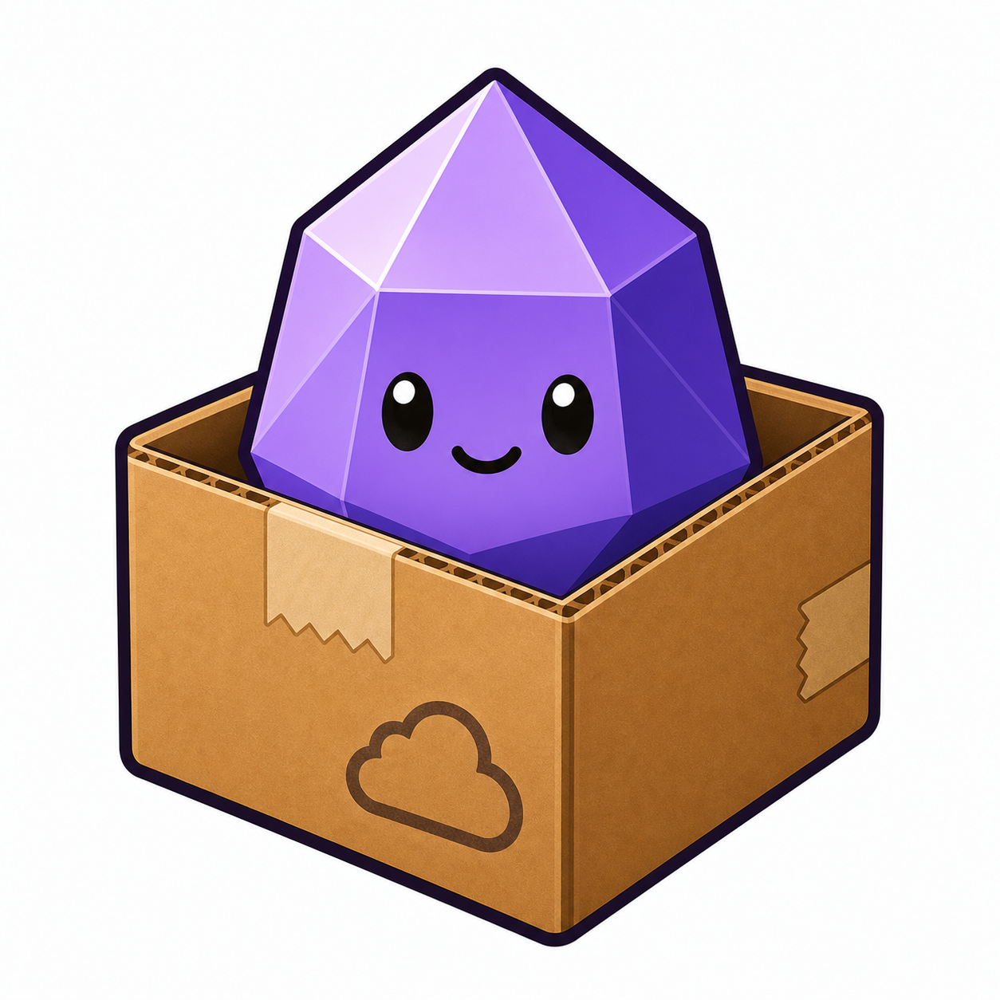
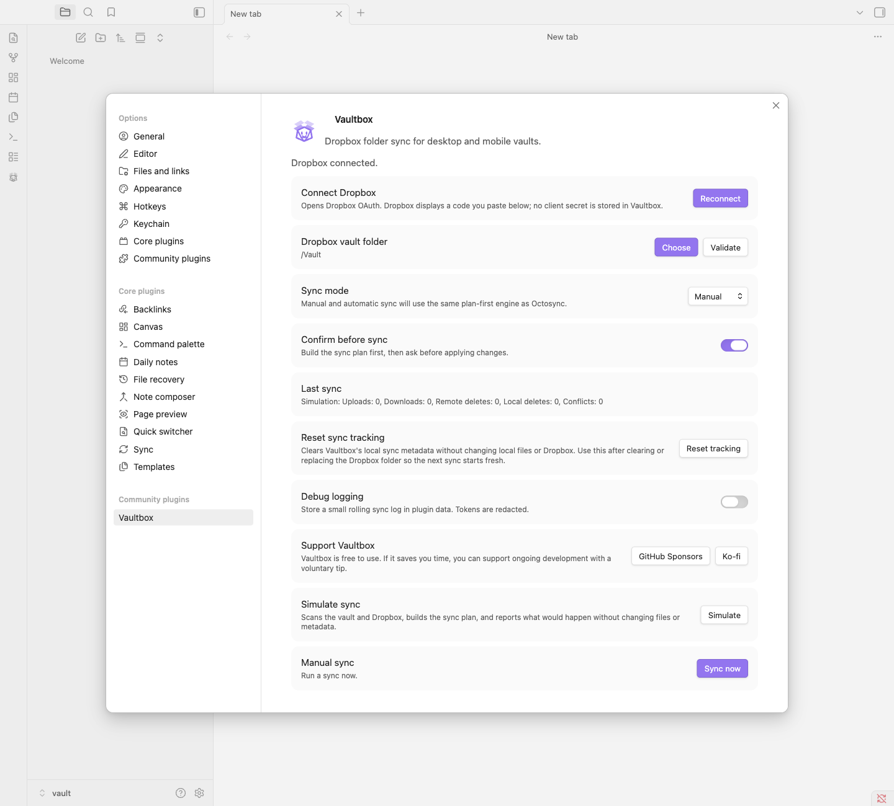

# Vaultbox

<p align="center">
  
</p>

Vaultbox is an Obsidian plugin that syncs a vault directly with a selected Dropbox folder on desktop and mobile.

It is built for people who already keep a vault in Dropbox on a desktop machine, but cannot use that same Dropbox folder from Obsidian mobile. Vaultbox talks to the Dropbox API from inside Obsidian, so phones and tablets can sync against a Dropbox-backed vault without needing the Dropbox desktop client.

## Why Use It

- Sync a vault to a normal Dropbox folder.
- Use Dropbox-backed sync on phones and tablets where the Dropbox desktop client is not available.
- Pick an existing Dropbox folder, so desktop users can keep using their current Dropbox workflow.
- Preview changes with simulation before applying them.
- Choose manual sync for full control or automatic sync for routine updates.
- Keep `.obsidian/**` out of sync by default, avoiding token and device-specific settings leaks.
- Detect conflicts and stop for a user decision instead of silently overwriting notes.

Vaultbox is deliberately conservative. It plans the sync before applying it, tracks file metadata, treats deletes carefully, rechecks files before changing them, and uses Dropbox `rev` values for guarded remote writes.

## Sync Modes

Vaultbox supports two main workflows.

## Settings



**Manual sync** runs only when you click the ribbon icon, use the command palette, or start sync from settings. Manual mode can also require confirmation: Vaultbox prepares the sync plan, shows what it intends to upload, download, or delete, and waits for approval before changing anything.

**Automatic sync** can run on startup, on an interval, or both. It uses the same planning engine as manual sync, but applies safe plans without asking each time.

The settings screen also includes **Simulate sync**. Simulation builds the same plan as a real sync and reports what would happen without changing local files, Dropbox files, or Vaultbox metadata. It is useful before first sync, after changing Dropbox folders, and any time the vault state feels uncertain.

## First Sync Performance

Initial push syncs to an empty Dropbox folder can take a few minutes for larger vaults. Vaultbox intentionally favors consistency over raw throughput: it plans first, rechecks each local file before upload, uses guarded Dropbox writes, handles Dropbox write throttling with backoff, and only records files as synced after Dropbox confirms them.

That is slower than a bulk "fire and forget" upload, but it reduces the chance of turning a temporary network or API issue into a damaged vault. Vaultbox shows progress while it works.

If a first sync is interrupted or the selected Dropbox folder is manually cleared, use **Reset sync tracking** in settings. It clears Vaultbox metadata without deleting local files or Dropbox files, so the next sync starts from the current local and Dropbox contents.

## Safety Net

Sync tools need a high bar because mistakes can damage a vault. Vaultbox includes unit tests for the sync planner, sync executor, Dropbox client, auth flow, debug logging, throttling retry behavior, and progress reporting. It also includes live Dropbox end-to-end tests against disposable folders.

The automated tests cover uploads, downloads, local deletes, remote deletes, stale Dropbox `rev` protection, first-sync behavior, conflict detection, case conflicts, reset tracking, and live Dropbox conflict modes.

That testing does not remove the need for backups, especially while the plugin is young, but it gives the sync logic a real safety net rather than relying only on happy-path manual testing.

## Privacy And Access

Vaultbox enumerates vault files so it can compare local paths with the selected Dropbox folder and decide what needs to sync. It deliberately excludes `.obsidian/**` so plugin settings, tokens, and device-specific Obsidian state are not uploaded as notes.

Vaultbox requests Dropbox file metadata read and file content read/write scopes. The Dropbox app uses Full Dropbox access because the core use case is selecting an existing folder that may already be managed by the Dropbox desktop app. Vaultbox only operates inside the folder you select in settings.

Vaultbox does not read from or write to the system clipboard.

See the [privacy policy](docs/privacy-policy.md) for more detail.

## Support

Vaultbox is free to use. If it saves you time and you want to support ongoing development, you can sponsor the project on [GitHub Sponsors](https://github.com/sponsors/grumpydev) or send a one-off tip on [Ko-fi](https://ko-fi.com/grumpydev).

Support is optional and does not unlock features.

## Installation

The easiest installation path is the [Obsidian Community Plugin directory](https://community.obsidian.md/plugins/vaultbox). Search for **Vaultbox**, install it, then enable it from Community plugins.

## Manual Installation

Build or download the plugin files, then place them in:

```text
<vault>/.obsidian/plugins/vaultbox/
```

The folder should contain:

```text
main.js
manifest.json
styles.css
```

Restart Obsidian or reload plugins, then enable Vaultbox from Community plugins.

## Dropbox App Setup

Vaultbox uses the public Dropbox app key for **Vaultbox for Obsidian**:

```text
k671hqjipp2sdpl
```

The app secret must never be stored in the plugin or committed to the repository.

If you are creating your own Dropbox API app for development, configure it with:

- Scoped access.
- Full Dropbox access.
- PKCE/public clients enabled.
- Scopes for file metadata read and file content read/write.

Vaultbox uses the OAuth code flow without a redirect URI. Dropbox displays an authorization code on screen after approval; paste that code into Vaultbox. The plugin exchanges the code with the PKCE verifier and stores the refresh token in local plugin data.

## Development

See [CONTRIBUTING.md](CONTRIBUTING.md) for contribution guidelines, sync safety expectations, and release notes.

Install dependencies:

```bash
npm install
```

Run unit tests:

```bash
npm test
```

Run Dropbox API E2E tests:

```bash
npm run dropbox:token
npm run test:e2e
```

The E2E suite creates timestamped folders under `VAULTBOX_E2E_DROPBOX_TEST_ROOT`, uploads/downloads/updates/deletes files, verifies stale `rev` conflict behavior, runs the real planner/executor against live Dropbox data, and checks the sync conflict modes before cleaning up by default.

The token helper prints a Dropbox authorization URL, asks you to paste the authorization code shown by Dropbox, and writes the resulting refresh token to `.env.e2e`. Treat `.env.e2e` as secret local state.

Build:

```bash
npm run build
```

Install into a local test vault:

```bash
npm run local-install -- "/path/to/Test Vault"
```

Use a throwaway Dropbox account or folder while developing sync behavior.

## License

MIT
